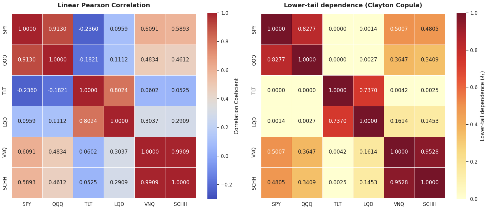

# Measuring Effective Diversification During Financial Crises
The cration of a metric that measures the diversification of a portfolio under a crisis scenario
---
## 🔍 Overview
This project proposes a quantitative framework to measure effective portfolio diversification under extreme market conditions, moving beyond traditional correlation matrices that often underestimate systemic risk during financial crises.
The methodology combines GARCH filtering, Clayton copulas, and information theory to:
- Estimate lower-tail dependence structures across multi-asset portfolios.
- Perform spectral analysis on tail dependence matrices to identify dominant crisis risk factors.
- Compute the Effective Number of Assets Under Crises (ENAUC) using spectral entropy to quantify surviving diversification.

---
## 🧮 Methodology

The methodology is structured into five main stages, combining time-series analysis, copula-based dependence modeling, and information theory:

### 1. Volatility Filtering
To isolate the core dependence structure from conditional heteroskedasticity (volatility clustering), a GARCH(1,1) model is fitted to the daily log returns of each asset:

$$r_{t} = \mu + \epsilon_{t}$$

$$\sigma_{t}^{2} = \omega + \alpha\epsilon_{t-1}^{2} + \beta\sigma_{t-1}^{2}$$

Standardized residuals are obtained to eliminate time-varying volatility effects:

$$\hat{z}_{t} = \frac{\hat{\epsilon}_{t}}{\hat{\sigma}_{t}}$$

### 2. Uniform Margins
The standardized residuals are transformed into uniform variables on the interval $[0,1]$ using the empirical probability integral transform to prepare them for copula estimation:

$$u_{t} = \frac{\text{rank}(z_{t})}{n+1}$$

### 3. Clayton Copula Framework
To capture asymmetric lower-tail dependence, a bivariate Clayton copula is fitted to each asset pair:

$$C_{\theta}(u,v) = (u^{-\theta} + v^{-\theta} - 1)^{-1/\theta}, \quad \theta > 0$$

Where $\theta$ represents the dependence parameter.

### 4. Tail Dependence Matrix
Using the estimated parameter for each pair (i,j), the lower-tail dependence coefficient is calculated to construct a symmetric tail dependence matrix $\Lambda$:

$$\Lambda = \begin{cases} 2^{-1/\hat{\theta}_{ij}} & i \neq j \\ 1 & i = j \end{cases}$$

### 5. Spectral Entropy and ENAUC
An eigen-decomposition of the tail dependence matrix $\Lambda = QDQ^{\top}$ is performed. The resulting eigenvalues $\lambda_i$ are normalized to form a probability distribution over the dependence spectrum:

$$p_{i} = \frac{\lambda_{i}}{\sum_{j=1}^{n}\lambda_{j}}$$

Using Shannon's entropy, the spectral entropy ($H$) is computed to measure the concentration of risk factors. Finally, the **Effective Number of Assets Under Crises (ENAUC)** is defined as:

$$\text{ENAUC} = e^{H}$$

---
## 📚 Documentation and Implementation

**Theory and Mathematical Development**  
Available in the `ENAUC_report` directory.

**Python Implementation and Simulations**  
Available in the `notebooks` directory.

---

## 📈 Results and Model Analysis

### Dependence Matrix Comparison

The empirical contrast between traditional linear correlation and Clayton copula lower-tail dependence demonstrates that average co-movements and crisis dynamics differ significantly.

* **SPY-QQQ Persistence:** The strong relationship between SPY and QQQ remains highly coupled under extreme market conditions, driven by common systemic risk factors.
* **Equity-Treasury Decoupling:** Lower-tail dependence drops to exactly 0.0000, confirming that long-term Treasury bonds (TLT) experience zero contagion during equity market crashes.
* **Fixed-Income Tail Risk:** TLT and LQD exhibit substantial lower-tail dependence, showing that diversification within fixed income weakens during periods of stress.
* **Real Estate Concentration:** Real estate ETFs (VNQ and SCHH) lock into near-perfect dependence, providing virtually no diversification during a crisis.

### Spectral Analysis

Table 1 presents the normalized eigenvalue spectra to evaluate risk concentration:

| Rank | Pearson Correlation | Tail Dependence |
| :---: | :---: | :---: |
| **1** | 0.518 | 0.460 |
| **2** | 0.313 | 0.290 |
| **3** | 0.132 | 0.175 |
| **4** | 0.024 | 0.041 |
| **5** | 0.011 | 0.026 |
| **6** | 0.001 | 0.008 |

Under Pearson correlation, the dominant eigenvalue accounts for $51.8\%$ of total risk. In contrast, the tail dependence framework shifts weight toward secondary factors (the third eigenvalue rises from $13.2\%$ to $17.5\%$), proving that crisis risk is more evenly distributed across different asset classes.

### Effective Diversification Metrics

The portfolio's macro-metrics derived from spectral entropy are summarized below:

- **Nominal Number of Assets:** $6.00$
- **Effective Number of Assets (Pearson):** $3.07$
- **Effective Number of Assets Under Crises (ENAUC):** $3.62$
- **Diversification Survival Ratio:** $60.3\%$

While linear correlation suggests only $3.07$ independent risk sources under normal conditions, the **Effective Number of Assets Under Crises (ENAUC)** rises to $3.62$. This indicates that $60.3\%$ of nominal diversification survives market panics, primarily driven by the absolute tail independence of Treasury bonds (TLT) and corporate bond decoupling (LQD) from equities.

